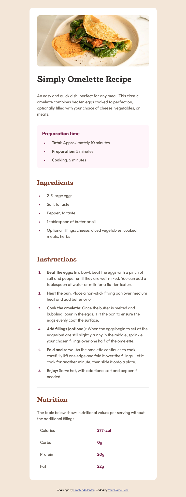

# Frontend Mentor - Recipe page solution

This is a solution to the [Recipe page challenge on Frontend Mentor](https://www.frontendmentor.io/challenges/recipe-page-KiTsR8QQKm). Frontend Mentor challenges help you improve your coding skills by building realistic projects. 

### The challenge

Your challenge is to build out this social links profile and get it looking as close to the design as possible.

### Links

- Solution URL: [Add solution URL here](https://your-solution-url.com)
- Live Site URL: [Add live site URL here](https://your-live-site-url.com)

### Screenshot



### Built with

- Semantic HTML5 markup
- CSS custom properties
- Flexbox

### What I learned

I learned how to directly target ol/ul > li bullet points or numbers to style them independently, instead of styling the entire li element. This can be done using the li::marker pseudo-element:

```css
li::marker {
  color: var(--rose800);
  font-size: 1.3rem;
  font-weight: bold;
}
```

I also learned how to adjust the spacing of ul/ol > li tags so that bullet points or numbers align properly with the rest of the page. You can achieve this by adding the desired amount of spacing between the bullet points/numbers and the rest of the li text:

```css
ol, ul, li {
  padding-left: 1.2em;
}
```

## Author

- Frontend Mentor - [@Rgeb1](https://www.frontendmentor.io/profile/Rgeb1)
- GitHub - [@yourusername](https://www.twitter.com/yourusername)